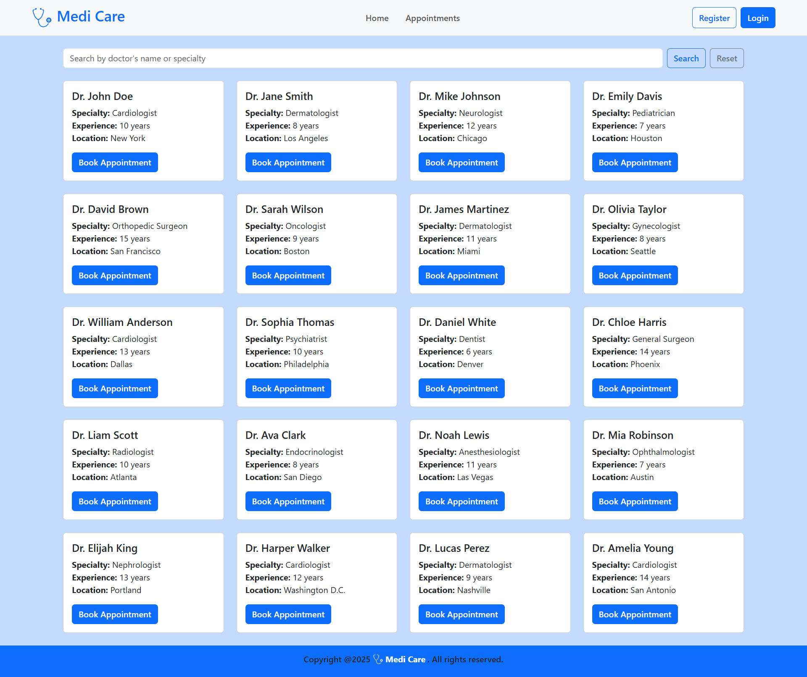
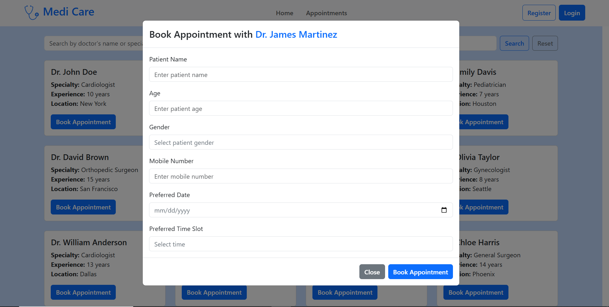
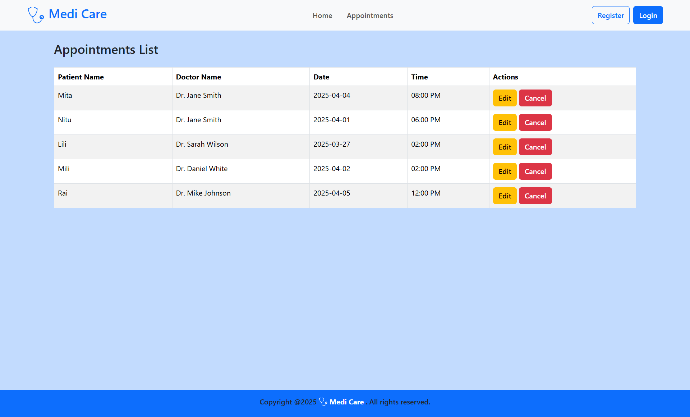
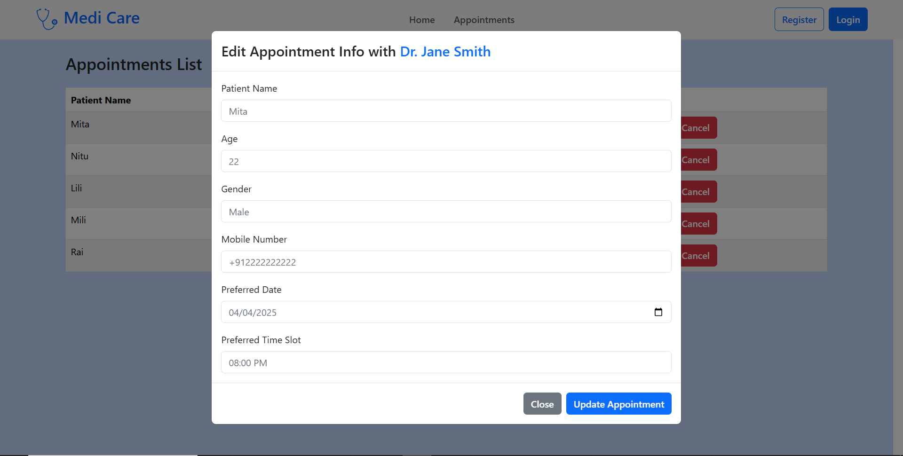

# Project Name: Medi Care Website

# Website Link:
https://medi-care-frontend.vercel.app

# Technologies:
JavaScript, Bootstrap, React Bootstrap, ReactJS, React Router, Local Storage.

# Description:
Building a Doctor Search & Appointment Booking UI with the following features:

# 1. Homepage (Doctor Search)
A search bar where users can enter a doctor's name or specialty.
Display a list of doctors (fetch from a mock API or use a predefined list).
Each doctor card should display:
Doctor's Name
Specialty
Experience (years)
Location
"Book Appointment" button
Ensure the UI is responsive.

# 2. Appointment Booking Form (Popup/Separate Page)
When a user clicks on "Book Appointment," open a modal/popup or navigate to a new page.

Form fields:
Patient Name
Age
Gender (Dropdown)
Mobile Number
Preferred Date (Date Picker)
Preferred Time Slot (Dropdown)
Submit button to save appointment details in local state (no backend required).

# 3. Appointments List Page
Display a table/list of booked appointments.

Each row should have:
Patient Name, Doctor Name, Date, Time
"Edit" and "Cancel" buttons.
Editing should allow modification of appointment details.

# Website View:

# Landing Page:

# Home Page:

# Appointment Form Adding Modal:

# Appointments Page:

# Appointment Form editing Modal:

# Run

# Clone this repository
$ git clone https://github.com/ShailySarker/Medi-Care-Frontend  

# Go into the repository
$ cd Medi-Care-Frontend

# Install dependencies
$ npm install

# Run the app
$ npm run dev
